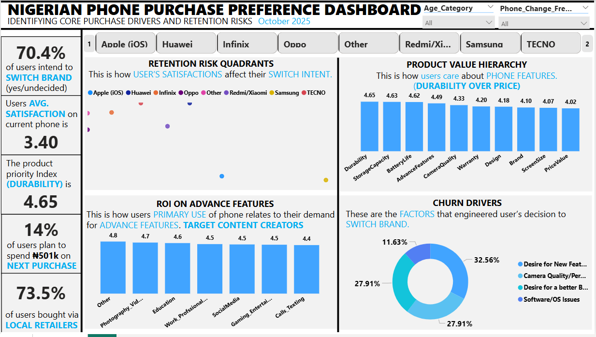
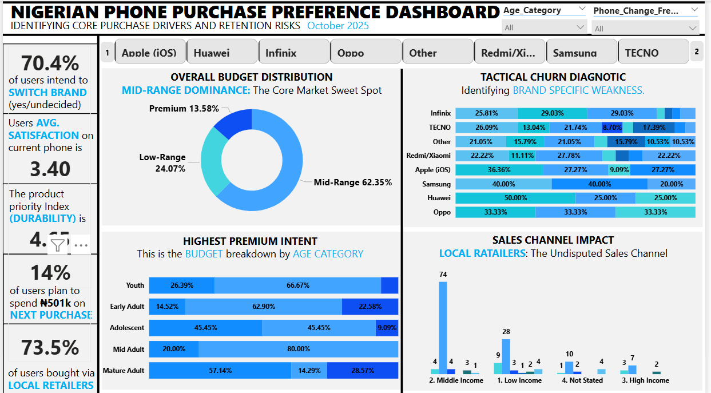

# 📱 Phone Purchase Preference Analysis - Nigeria Consumer Survey

> A full-cycle data analytics project: from survey design to Excel for data cleaning and preprocessing to SQL querying, Power BI dashboard, and actionable consumer insights.

---

## Table of Contents

- [Project Overview](#project-overview)
- [Project Goal](#project-goal)
- [Methodology](#methodology)
- [Dataset](#dataset)
- [Data Visualization](#data-visualization)
- [Key Metrics](#key-metrics)
- [Trends and Insights](#trends-and-insights)
- [Recommendations](#recommendations)
- [Tools Used](#tools-used)
- [Files in This Repository](#files-in-this-repository)
- [Conclusion](#conclusion)

---

## Project Overview

### Title: Mobile Phone Purchase Preference Analysis — Nigerian Consumer Behaviour Study

This project investigates the mobile phone purchasing behaviour of Nigerian consumers through a structured survey. The analysis uncovers what drives purchase decisions, identifies brand loyalty patterns, explores budget sensitivities across demographic groups, and surfaces the motivations behind brand switching.

The project spans the complete data analytics lifecycle — survey design, data collection, data cleaning, SQL-based querying, and interactive Power BI dashboard development — making it a comprehensive demonstration of end-to-end analytical capability.

---

## Project Goal

The core objectives of this project are to:

- Identify the most influential features driving phone purchase decisions among Nigerian consumers
- Analyse brand usage, satisfaction levels, and switching intent across demographic segments
- Understand how income level, age, and employment status shape budget allocation for smartphones
- Explore purchase channel preferences and what they reveal about consumer trust and convenience
- Deliver actionable insights that could inform marketing strategy, product positioning, and retail decisions for mobile brands operating in Nigeria

---

## Methodology

This project followed a structured 5-phase analytics methodology:

### 1. Survey Design & Data Collection
- Designed a structured Google Form capturing demographic data (age, gender, employment, income) alongside behavioural metrics (brand loyalty, switch intent, feature priorities, purchase channel, budget)
- Collected **162 valid responses** across age groups, employment categories, and income ranges
- Multi-select use-case columns were encoded as binary flags for efficient SQL querying

### 2. Data Cleaning & Preparation
- Standardised inconsistent categorical entries (e.g., duplicated employment status labels)
- Resolved column naming issues and whitespace errors
- Encoded multi-choice fields into binary indicator columns
- Grouped continuous variables (income, budget) into meaningful categorical ranges
- Cleaning performed in **Microsoft Excel** with additional transformation in **Power Query Editor**

### 3. SQL Analysis
- Loaded cleaned dataset into **Microsoft SQL Server**
- Wrote targeted SQL queries addressing 7 key business questions covering feature ranking, use-case-driven importance, brand satisfaction, switching reasons, budget distribution, and upgrade frequency
- Applied `UNION ALL`, `GROUP BY`, window functions (`OVER/PARTITION BY`), conditional aggregation (`CASE WHEN`), and `FORMAT()` for percentage outputs

### 4. Data Modelling & Dashboard Design
- Built a star schema model in Power BI with a central fact table and supporting dimension tables
- Created DAX measures for satisfaction averages, switch rate percentages, feature importance rankings, and demographic breakdowns
- Developed a multi-page interactive Power BI report with slicers, bar charts, donut charts, card KPIs, and matrix visuals

### 5. Insight Extraction & Reporting
- Synthesised quantitative findings into human-readable consumer insights
- Segmented results across gender, age group, income bracket, and brand affiliation
- Translated insights into strategic recommendations relevant to brands, retailers, and marketers

---

## Dataset

| Property | Detail |
|---|---|
| Survey Responses | 162 respondents |
| Total Columns | 32 fields |
| Data Types | Categorical, Binary (0/1), Ordinal (1–5 Likert scale), Continuous |
| Geography | Nigeria |
| Collection Method | Google Forms survey |
[View Dataset](Cleaned_Phone_Purchase_Preference.xlsx)

### Column Categories

- **Demographics:** Gender, Age Group, Age Category, Employment Status, Monthly Income, Income Range (NGN)
- **Brand & Usage:** Current Brand, Phone Change Frequency, Primary Use Cases (7 binary columns)
- **Satisfaction & Loyalty:** Overall Satisfaction, Switch Intent, Reason for Switch
- **Financial Behaviour:** Budget for Next Phone, Budget Range (NGN), Purchase Channel
- **Feature Importance (Likert 1–5):** Price/Value, Camera Quality, Battery Life, Design, Brand, Advanced Features, Storage Capacity, Screen Size, Durability, Warranty

---

## Data Visualization

### Dashboard (Power BI)

---

## Key Metrics

| Metric | Value |
|---|---|
| Total Respondents | 162 |
| Dominant Gender | Female (59.3%) |
| Largest Age Segment | Youth (44.4%) |
| Most Used Brand | Apple iOS (21.6%) |
| Top Feature (Importance) | Durability (4.65 / 5) |
| Switch Intent — Yes | 53.1% |
| Most Common Budget Range | Mid-Range (62.3%) |
| Primary Purchase Channel | Local Retailer (73.5%) |
| Highest Satisfaction Brand | Samsung (4.17 / 5) |
| Most Common Upgrade Trigger | Phone Breakdown (64.8%) |

---

## Trends and Insights

### 👥 Demographics
- The survey skewed **female (59%)** and was dominated by **Youth (18–24) and Early Adults (25–34)**, together accounting for over 82% of respondents
- **Students (35.8%)** were the single largest employment group, followed by full-time employees (30.2%), reflecting a younger, aspirational consumer base
- **Middle income earners** made up the majority (53.1%), with low income at 29%

---

### 📊 Feature Priority Ranking

| Rank | Feature | Avg. Importance (/ 5) |
|---|---|---|
| 1 | Durability | 4.65 |
| 2 | Storage Capacity | 4.63 |
| 3 | Battery Life | 4.62 |
| 4 | Advanced Features | 4.49 |
| 5 | Camera Quality | 4.33 |
| 6 | Warranty | 4.20 |
| 7 | Design | 4.18 |
| 8 | Brand | 4.10 |
| 9 | Screen Size | 4.07 |
| 10 | Price/Value | 4.02 |

> **Key Takeaway:** Nigerian consumers prioritise functional longevity — durability, storage, and battery life rank higher than aesthetics or price alone. This challenges the assumption that price is the primary driver in emerging markets.

---

### 📱 Brand Landscape

- **Apple iOS** leads in market share among respondents (21.6%), followed closely by **Infinix (21%)** and **TECNO & Redmi/Xiaomi** (both at 14.2%)
- **Samsung** records the highest satisfaction score (4.17/5) despite ranking 6th in usage — suggesting a quality-usage gap and potential room for Samsung to recapture market share
- **Infinix**, the second most-used brand, has the **second-lowest satisfaction (3.12/5)**, indicating significant loyalty risk
- Apple users, despite the brand's premium positioning, report moderate satisfaction (3.66/5), suggesting unmet expectations relative to price

---

### 🔄 Switch Intent & Reasons

- A striking **53.1% of respondents intend to switch brands**, with a further 17.3% undecided — meaning only 29.6% are actively loyal to their current brand
- Among those switching or undecided, the **top reasons are:**
  1. Desire for new features (24.3%)
  2. Desire for a better brand ecosystem (20.9%)
  3. Camera quality/performance (20.9%)
  4. Software/OS issues (8.7%)
  5. Poor battery life (7.0%)

> **Key Takeaway:** Feature evolution and ecosystem quality are the primary churn drivers — not price. Brands that fail to innovate meaningfully risk losing even satisfied customers.

---

### 💰 Budget & Purchase Behaviour

- **62.3% of respondents** plan to spend within a **Mid-Range** budget for their next phone
- Only **13.6% are Premium buyers**, concentrated in the high-income bracket
- **Local Retailers dominate** as the purchase channel of choice at 73.5%, with online stores accounting for just 4.3% — revealing the critical importance of physical retail presence and distributor networks in the Nigerian market
- Budget sensitivity increases with age: Mid Adults and Mature Adults skew more toward Low-Range budgets, while Youth and Early Adults distribute across Mid-Range and Premium tiers

---

### 🔁 Upgrade Frequency

- The overwhelming majority (**64.8%**) only upgrade **when their phone breaks down** — indicating that aspirational upgrade marketing has limited reach unless tied to device failure pain points
- Only **5.6% upgrade annually**, mostly Premium-segment buyers
- This reactive replacement cycle suggests opportunity for brands offering trade-in programmes, warranties, and durability guarantees

---

## Recommendations

1. **Lead Marketing With Durability and Battery Messaging**
   Across all demographics, durability and battery life rank highest. Brands should lead with these in campaigns rather than camera specs, which — while important — rank 5th.

2. **Infinix Must Address Satisfaction Urgently**
   With the highest usage but second-lowest satisfaction, Infinix is most at risk of mass switching. Software experience and post-sales service need immediate investment.

3. **Samsung Should Capitalise on Its Satisfaction Lead**
   Samsung's satisfaction-to-usage gap represents an underexploited advantage. Targeted re-engagement campaigns and accessible mid-range offerings could grow market share.

4. **Invest in Physical Retail Channels**
   With 73.5% purchasing through local retailers, brands must prioritise distributor relationships, in-store visibility, and retailer training programmes — not just digital channels.

5. **Target the Middle-Income, Youth-Dominated Segment**
   The convergence of Middle Income + Youth represents the largest addressable consumer segment. Mid-range devices (₦100K–₦300K range) with premium-feel features should be the hero product strategy.

6. **Build Ecosystem Lock-In to Reduce Switching**
   The second top switching driver is the desire for a better brand ecosystem. Brands should invest in integrated services — cloud storage, audio, payments, app stores — to create switching friction.

7. **Design Reactive Upgrade Campaigns**
   Since most upgrades are triggered by device failure, brands should deploy targeted messaging and partnerships with repairers/retailers to intercept this moment with trade-in or upgrade offers.

---

## Tools Used

| Tool | Purpose |
|---|---|
| Google Forms | Survey design and data collection |
| Microsoft Excel | Initial data cleaning and formatting |
| Power Query Editor | Advanced data transformation and normalisation |
| Microsoft SQL Server | Analytical querying (7 structured business questions) |
| Power BI Desktop | Data modelling (star schema), DAX measures, dashboard |

---

## Files in This Repository

| File | Description |
|---|---|
| `Mobile_Phone_Purchase_Preferences_Survey_Responses.xlsx` | Raw survey responses from Google Forms |
| `Cleaned_Phone_Purchase_Preference.csv` | Cleaned and transformed dataset ready for analysis |
| `Phone_Preference_Script.sql` | SQL queries for all 7 analytical questions |
| `Phone_Purchase_Preference.pbix` | Power BI desktop file with full dashboard |
| `README.md` | Project documentation (this file) |

---

## Conclusion

This project demonstrates the full scope of a consumer analytics engagement — from survey architecture through to business-ready insights delivered via an interactive dashboard. The analysis reveals a Nigerian smartphone market characterised by functional, longevity-focused consumers, fragile brand loyalty, reactive upgrade cycles, and a retail ecosystem still firmly anchored in physical channels.

For brands, marketers, and product teams operating in Nigeria's mobile space, the implications are clear: compete on durability and ecosystem value, not just specs or price, and meet consumers where they actually shop.

---

Want to know more?  
> Feel free to reach out: [ajagunalliyu@gmail.com](mailto:ajagunalliyu@gmail.com)  
> Connect with me on [LinkedIn](https://www.linkedin.com/in/alliyuajagun)  
> Follow on [Twitter/X](https://x.com/Sayyid_Alliyu)  
> Read more on [Medium](https://medium.com/@ajagunalliyu)  
> 💻 Explore more projects on [GitHub](https://github.com/ajagunalliyu)
---

**Prepared by:**  
**Alliyu Ajagun Aremu**
