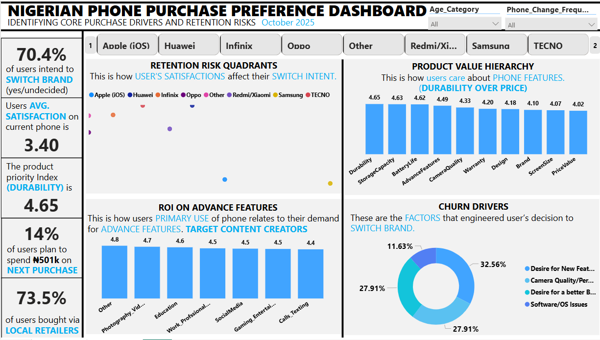
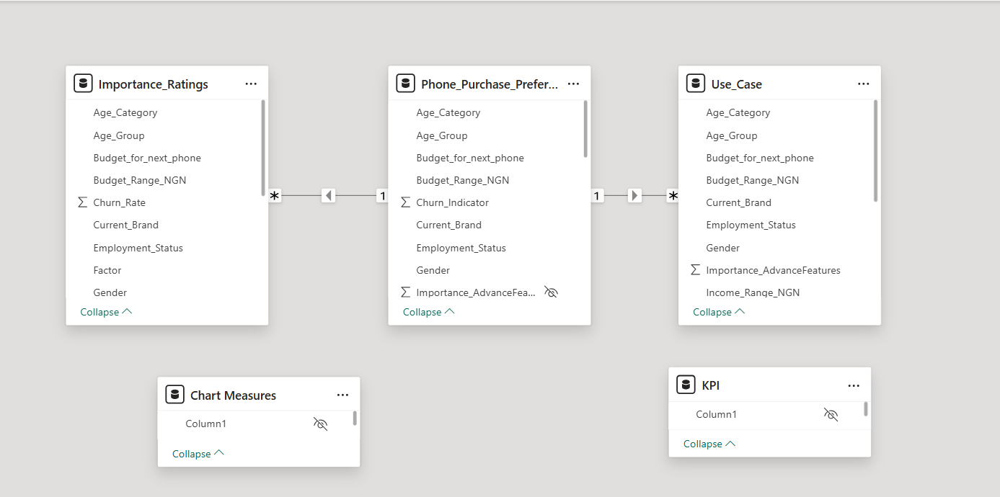

# Phone Purchase Preference Analysis - Nigeria Consumer Survey

> A full-cycle data analytics project: from survey design to Excel for data cleaning and preprocessing to SQL querying, Power BI dashboard, and actionable consumer insights.

Mobile brands operating in Nigeria needed to know what actually drives a phone purchase, beyond assuming it's price or camera specs. I designed and ran a 162-respondent survey, cleaned it in Excel/Power Query, analyzed it across 7 business questions in SQL Server, and built a star-schema Power BI dashboard. The biggest surprise: durability, storage, and battery life outrank price and camera quality as purchase drivers; 53.1% of consumers intend to switch brands, and 73.5% still buy through local retailers rather than online, directly challenging assumptions brands often make about this market.

### The Business Problem

Mobile brands, retailers, and marketers needed to understand what drives phone-purchase decisions among Nigerian consumers, how brand loyalty and switching intent break down by demographic, how income shapes budget, and which channels consumers actually trust, to inform marketing, product positioning, and retail strategy.

### Data & Method

- Collection: custom Google Forms survey, 162 valid responses, 32 fields spanning demographics, brand usage, satisfaction, financial behavior, and Likert-scale feature importance
- Cleaning: standardized inconsistent categorical labels, encoded multi-select fields as binary flags, grouped income/budget into ranges - done in Excel + Power Query
- Analysis: SQL Server queries across 7 structured business questions using UNION ALL, GROUP BY, window functions, and CASE WHEN conditional aggregation
- Modeling: star schema in Power BI with DAX measures for satisfaction averages, switch-rate %, and feature-importance rankings

[Sales Analysis SQL](sql_queries/Phone_Preference.sql)

### Key Insights

- "Durability (4.65/5) beats price (4.02/5) as Nigeria's top phone-purchase driver - challenging the assumption that price leads emerging markets" reframes what brands should lead with in marketing.
- "53.1% of consumers intend to switch brands, driven by feature stagnation and ecosystem gaps - not price."  Churn is a product problem, not a pricing problem.
- "Infinix has the highest usage (21%) but the second-lowest satisfaction (3.12/5) — putting it at the highest switching risk" - a specific, named competitive vulnerability.
- "Samsung leads satisfaction (4.17/5) despite ranking 6th in usage — an unclaimed market-share opportunity" - a quality-usage gap brands could exploit.
- "73.5% of purchases happen through local retailers, versus just 4.3% online" — physical retail, not e-commerce, is where this market is won.

### Clear Recommendations

- Lead marketing messaging with durability and battery life, not camera specs or price.
- Infinix should urgently address software/post-sales experience - highest usage, weak satisfaction is the riskiest combination.
- Samsung-type brands should run targeted re-engagement campaigns to convert their satisfaction lead into usage share.
- Invest in physical retail relationships and in-store visibility over digital-only channels.
- Target the middle-income, youth-dominated segment with mid-range (₦100K–₦300K) devices carrying premium-feel features.
- Build ecosystem lock-in (cloud, payments, app stores) to raise switching friction.

Link: Links: [Live dashboard](https://app.powerbi.com/view?r=eyJrIjoiNDdhOGUzZjItZmVkNS00NjQwLWJhNTItMzVkYjRkODY3ZmNmIiwidCI6ImI2NDU3ZDY4LTQzODgtNGMzYS04MjIyLTc0ZGU0NDU5ZDFlZiJ9&pageName=4dc279cf76ca60708e22) · 

## Let's Connect
 
> Feel free to reach out: [ajagunalliyu@gmail.com](mailto:ajagunalliyu@gmail.com)  
> Connect with me on [LinkedIn](https://www.linkedin.com/in/alliyuajagun)  
> Follow on [Twitter/X](https://x.com/Sayyid_Alliyu)  
> Read more on [Medium](https://medium.com/@ajagunalliyu)  
> 💻 Explore more projects on [GitHub](https://github.com/ajagunalliyu)
> View [Portfolio website](https://alliyutheanalyst.lovable.app/)

## ⭐ Support

If you found this project helpful or interesting, consider giving the repository a **star**. Your support helps increase the visibility of my work and encourages me to continue building and sharing data analytics projects.

Thank you for visiting!

